===========================
Animal Movements
===========================

.. contents:: Table of Contents
   :depth: 2

Creating a new Project
============================

1. Start the Animal Movements application (NPS-Alaska users will find it at
   ``X:\GIS\Apps\AnimalMovement\10.1\AnimalMovement.exe``).

2. Click on the **Project Investigator Details** button.  If you do not see this button,
   then you are not a PI, and cannot create you own project.  If you should be a PI, please
   contact the database administrator (regan_sarwas@nps.gov).  If you want to create a
   project for another PI, then click on the **Project List** instead.

3. Below the project list, click on the green add(+) button.

  a. If you are creating this project for another PI, then select their name in the list.
     The list is all the PIs that have given you permission to assist them.  If the name
     need is not in the list, contact the PI and ask that they give you permission.
  
  b. Provide a short (less than 16 characters) code for the project.  This will be used
     in some lists, and in database queries to identify the new project.  The code is
     required, and must be unique.

  c. Provide a short but descriptive name for the project.  This name will be used in
     most reports, and in the application to identify your project.  A name is required.
  
  d. Optionally provide a Park Service Unit code and additional descriptive details.
  
  e. Click **Create**.  If the Code you choose was not unique, you will be notified,
     and given a chance to select a new code.
  

Creating a new Argos Project
============================

These instructions assume you have purchased the Argos service from CLS America, and that
they have allocated Argos ID numbers to you.  Furthermore you will need the Program
number, username, and password that they provide.

An **Argos Platform** is a unique Argos ID cooresponding to the hardware installed on a
animal tracking collar.  An Argos Platform may be re-used on different collars, but will
only be on one collar at a time.  A refurbished collar may be given a new Argos ID.  Once
again, a collar can only have zero or one single Argos Platform at a given point in time.
The Argos Platform is often refered to as the Argos Id of a collar.  Argos Platforms are
organized into an Argos Project.  A project investigator is given a username and password
to manage the Argos Program on the Argos website (https://argos-system.clsamerica.com).

Once given the necessary program information, the Animal Movements application can
contact the Argos website and download the details on the Argos Platforms in the
program.  The PI can specify if the program will be automatically and regularly queried
for new collar data.  It is the PI's responsibility to relate the Argos Platforms to
a collar.  For Telonics Gen4 collars this is done automatically when the TPF file is
loaded into the database.

1. Start the Animal Movements application (NPS-Alaska users will find it at
   ``X:\GIS\Apps\AnimalMovement\10.1\AnimalMovement.exe``).

2. Click on the **Project Investigator Details** button.  If you do not see this button,
   then you are not a PI, and cannot create you own Argos program.  If you should be a PI,
   please contact the database administrator (regan_sarwas@nps.gov).  If you want to create a
   project for another PI, then click on the **Project List**, select one of thier projects,
   and then click the PI info button on the project details page.

3. Click the **Argos** tab on the Project Investigator Details** page.

4. Below the program list, click on the green add(+) button.  (NOTE: if the program
   number is already in the list, then you "re-create" it.  You must get a new program
   number from CLS America, or skip the program creation step and add the new platforms
   to the existing program.

  a. Provide the Program Id, Program Name, Username, and Password exactly as provided by
     CLS America.
  
  b. The start and end dates can also be entered, however they are purely informational
     and not used by the database in any automated processes.
  
  c. By checking the **Active** option, you are declaring your wish that this program
     is downloaded from the Argos website on a regular (daily) basis.  If the collars in
     this project are not yet deployed, then you can check this option when the collars
     are deployed, however the website only maintains 10 days worth of data, so if you want
     this feature, be sure to do it with 10 days of deploying your collars.
  
  d. Click **Create**.  If the Code you choose was not unique, you will be notified,
     and given a chance to select a new code.
  
5. Select newly created program in the list, and click the info(i) button, or double
   click the program number/name in the program list.

6. Select the **Argos Platforms** tab on the **Argos Program Details** page.

7. Click the **Add Missing Platforms** button.

8. Click the Close button(s) as necessary.

Loading Collars Into the Database
====================================

Loading Animals Into the Database
====================================

Deploying Collars On Animals
====================================

Uploading Store on Board Data
====================================

Gen4 datalog files (\*.tdf) files can be uploaded directly to the database. The database
will archive this file and use Telonics Data Convertor (TDC) software in the background
to create a \*.csv file that is used to create the collar fixes. Because of the binary
format for the Gen3 download
files (\*.tfb), and because the Telonics Data Download Utility V1.41, cannot be run in the
background, it is not possible to upload these files directly.  If you have \*.tfb files,
you must first use the Telonics Data Download Utility V1.41 to create a \*.csv file, and
then follow the remaining instructions.

Tell the database that you have retrieved the collar
------------------------------------------------------------------------------------------

This not required to see your data, but it is good bookkeeping.  By doing this, the
database is able to hide any fixes that occur after the retrieval date/time.  It also
frees the collar up for potential redeployment on another animal.

This task is most efficiently done with deactivating old files, so the step by step
instructions are in the next section.

Deactivate old files
------------------------------------------------------------------------------------------

This is not required to see your data, but it has several benefits.

+  It can speed up the database.  The new fixes will in most cases, hide fixes that were
   received by email or web services download.  This effort of finding and hiding
   overlapping fixes is removed if the old files are first deactivated.
+  It will remove any fixes that were altered in the Argos transmission.  If a GPS fix
   that was transmitted via Argos was slightly altered in time, it will not be hidden
   by the new store-on-board data.  It is also possible that the time is the same, but
   the location is different.  The database considers this a conflict that requires
   attention (by default the last data in wins, so your store-on-board data will hide
   the Argos data).  These errors are more common with Gen3 data.

To retrieve collars and deactivate old files, use this step-by-step procedure

1.  Start the Animal Movements application.
#.  Click on the **Project Investigator Details** button in the main menu.
    If you are not a project
    investigator you will not see this button and you cannot perform this task.
    
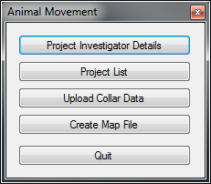

3.  Click on the **Collars** tab in the **Project Investigator Details** form.

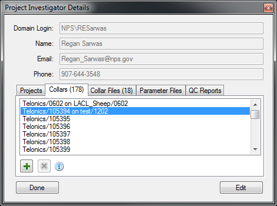

4.  Double click on deployed collar that was recently retrieved.
    Deployed collars will list the animal it is deployed on.
#.  Click on the **Animals** tab in the **Collar Details** form.

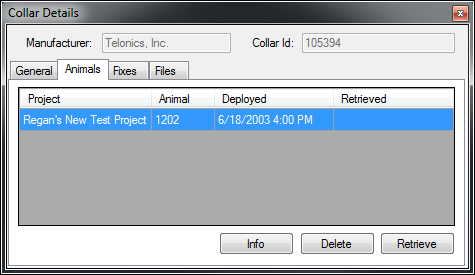

6.  Click on the **Retrieve** button.
#.  Enter the date and time the collar was removed from the animal. The time should be
    local time, not GPS (UTC) time.  Providing the time is optional (it defaults to 12
    noon), but is recommended, as it will ensure that fixes on that day before retrieval
    are retained, while those after the retrieval are hidden.

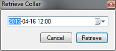

8.  Press the **Retrieve** button 
#.  Click on the **Files** tab in the **Collar Details** form.

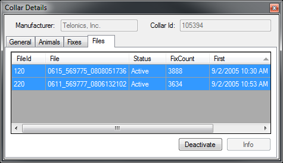

10. Select all the files that were from the deployment that was just retrieved.  If this
    collar has only been deployed on this one animal, and if have not loaded your
    store-on-board data yet, then you will want to select all files.  Use control-click
    or shift-click to select multiple files.  Do not select any *Inactive* files.  If all
    the selected files are *Active*, then the button at the bottom of the form will be
    labeled *Deactivate*, and it will be enabled.
#.  Click the **Deactivate** button
#.  Close the **Collar Details** form, and repeat at step 4 until all the collars have
    been retrieved.

     
Load the store-on-board data
------------------------------------------------------------------------------------------

You can bulk load an entire folder, or a selection of one or more files.  While selecting
a folder seems most convenient, you will need to make sure that only the files you want to
load are in the folder.  Any files not recognized as valid collar data files will result
in an error message.  In addition, if the folder contains \*.tdf and the resulting \*.csv
files, the program will load both files.  Since the database will create it's own version
of the CSV file from the \*.tdf file, you will redundant data in the database.
I recommend loading by file, and selecting just the files you want to load.

Most likely if you are a project investigator, you have access to the Telonics Data
Convertor (TDC) software to download you collars and create \*.csv files from your \*.tdf
files.  You can upload either type of file.  If you upload the \*.tdf file, then the
application (if it can find the TDC software on your computer) or the database (otherwise)
will create and upload the \*.csv file, and link it to the \*.tdf file.  I recommended
that you upload the \*.tdf files for several reasons

1. The \*.tdf file will be archived in the database.
#. The \*.tdf file includes the collar paramters in effect while deployed.
#. The \*.tdf file could be re-processed in the future if there is some concern that it
   may have been processed incorrectly.

Uploaded files can be associated with a Project Investigator, or a Project.  This
association only determines where the file is listed in the Animal Movements application.
I recommend that all files are associated with a project, unless a file contains data for
multiple collars.  In this case, the file should be associated with the appropriate
project investigator.

Step-by-step instructions for loading multiple Gen4 store-on-board data files.

1.  Start the Animal Movements application.
#.  Click on the **Project List** button in the main menu.

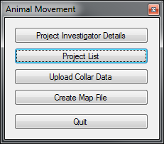

3.  Double click on the project that the new collar data is for.

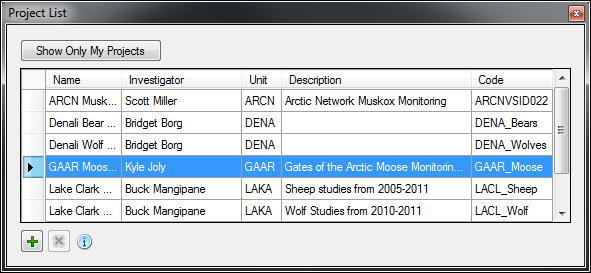

4.  Click on the **Files** tab in the **Project Details** form.

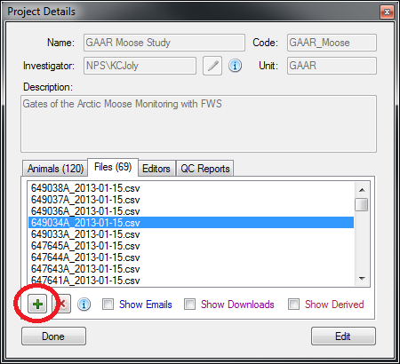

5.  Click the green plus sign at the bottom of the file list.  If this
    button is greyed-out, then you cannot add files to this project.
    You must be the owning project investigator or an editor on the project to add files.
    

6.  Click the **Browse** button for **File(s)** on the **Upload Collar Location Data**
    form.

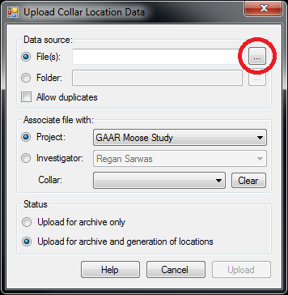

7.  In the **Open** dialog box, change the file type to **Telonics Datalog (\*.tdf)**

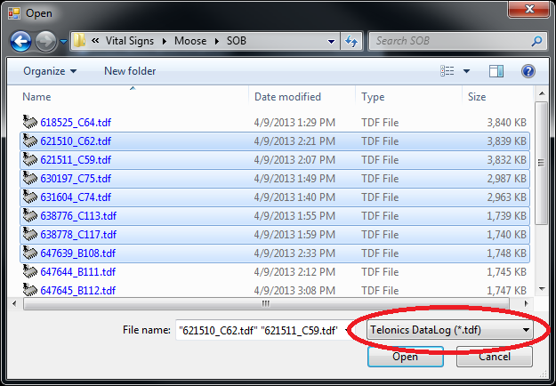

8.  Select the desired files.  You can select multiple files by draging your mouse across
    the file names, or use control-click or shift-click to select multiple files.
#.  Click the **Open** button to close the dialog box, and proceed.
#.  The **Upload** button on the on the **Upload Collar Location Data**
    form should now be enabled.
#.  In the *Associate file with* section leave all the **Collar** pick list blank .
    This will allow the application to determine the collar from the file contents.
    If you are **not** using CTN numbers as the collar Id, then you must load the files
    individually and manually assign the collar id for each file.
#.  Click the **Upload** button.  It may take several seconds to a minute to upload and
    process each file, depending on the availability of the TDC software, your network
    speed, the presence of active overlapping files for this collar, and the current
    workload on the database server. Depending on the server set up, the processing may
    not occur immediately, but may be schedules to occur in a batch at some later date.
#.  If the uploading/processing completed without errors or warnings, then the dialog
    box will close automatically.
#.  The uploaded files should appear at the top of the files list in the **Project
    Details** form.  To see the derived \*.csv files, click on the **Show Derived**
    check box.  If there are no derived files (they will be colored brown to match the
    **Show Derived** check box text, then the server has scheduled the processing for
    later.  At NPS, batch processing occurs every 10 minutes, if it was unable to be
    performed immediately for some reason.
    
.. image:: Images/sob-project-details-2.png

Editing Location Data
=====================

The title of this section is mis-named.
The source location data in the database is never deleted or altered.

Resolving Conflicting Fixes
---------------------------

Coming soon.

Hiding Bogus Fixes
-------------------

There is no way to change the time or location of a fix.  Nor should you.  You cannot add an ad-hoc location.
All fix data must come from the raw collar data.  This ensures a defensible dataset.
You can however decide that some location data is *bad*, and eliminate this from display and analysis.
These hidden locations are available for review, and can be *un-hidden* if your assessment of the data
changes in the future.

Removing Pre/Post Deployment data
---------------------------------

If you notice locations on the map that are before or after the collar was deployed on the animal,
Then you need to edit the deployment dates in the Database application.

Similarly if you think some locations may be missing from the map, you can increase the deployment range
to show locations that may be hidden.

Fixes that are outside the deployment dates are not shown in the invalid locations layer, they can only
be displayed/hidden by editing the deployment dates.

If an animal slips a collar, or a collar releases prematurely, this should be treated as a retrieved collar
to remove the locations of the stationary collar no longer on the animal.  Since you are not 'retrieval date'
in the deployment is not the date you actually retrieved the collar, you may want to make a note in the collar
table remarks section for future reference.

Dead Animals
------------

Identifying mortalities, and hiding the locations of the stationary collar is covered in the Mortalities section.
  

Using a bounding box to hide extreme locations
----------------------------------------------

There may be a tool to put in geographic coordinates that define the extreme boundaries of your project area.
Any locations that occur outside those bounds will automatically be hidden.  This is easy to do in the database,
and can be problematic in ArcMap.  There is a current limitation in ArcMap when you zoom out too far (so that more than one hemisphere is displayed
- easy to do in Alaska, where anything above 90 degrees north is in the other hemisphere).  In this case, the
database returns no locations, so you cannot see the data to hide the bogus locations.

This database feature will be coming soon.

Using ArcMap to Identify Bad Locations
--------------------------------------

There are primarily two was to identify bad locations in ArcMap.

1. Visual Review.  Some bad fixes are visually obvious when reviewing the movement vectors.
   These will show up as a spike from and immediately returning to a cluster of locations.

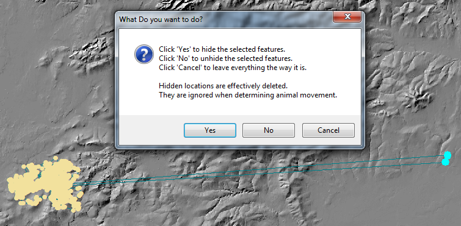

2. By reviewing the attributes (speed, duration, and distance) in the movement vectors table to identify
   suspect locations.  this is easiest to do if you first define a definition query on the locations and movement
   layers to limit the data to just one animal.

    a. In ArcMap, right click on the Movement Vectors layer and select Open Attributes

    b. Right click on either the speed, duration, or distance column and sort.  High speeds, short durations,
       or large distances are all the result of suspect locations.

    c. When you identify a movement vector that is suspect, note the start and ending time.

    d. Open the attribute table for the location data.

    e. Scroll to the locations at the start and end time.

    f. Select each location, starting two locations before the suspect vector,
       and proceeding to two locations after the suspect vector, and watch the animals progress
       on the map.  In this way, it is usually quite easy to identify which end of the vector is the bad location.

Hiding Location
----------------

1. Use the ArcMap Selection tool to select the unwanted location(s).

2. Click the paw print icon (Edit Location Status tool).

3. Click the Yes to hide the selected locations.

If you turn on the invalid locations layer, you will see these points have been removed from the valid locations/vectors layers
and added to the invalid locations layer.  If you want to re-activate them, select the points in the invalid locations layer, click the paw print,
and then select No to un-hide these locations.

Un-Hiding Locations
--------------------

coming soon.

Mortalities
===========

Dead animals should be identified so that the locations after the animal died are removed
from the data set used for analysis, particularly home range analysis.

Finding Mortalities
-------------------
This is done in ArcMap.  More to come.

Correcting for Mortalities
--------------------------

1. Click on Project List

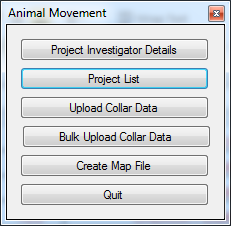

2. Double click your project

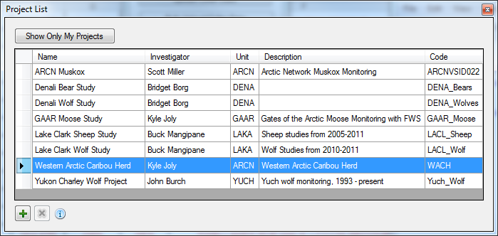

3. In the middle list, double click the animal that died

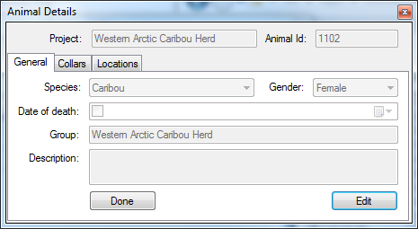

4. In the Animal Details window, click edit, then check the box next to Date of Death

5. Correct the date, then click Save.

.. image:: Images/Mortalities_AnimalDetails2.png

If you refresh the view in ArcMap, it should draw with the corrected data.

Close the windows (If you close the first window, it will close all the others), and your done.

ArcMap Tools
============

1. Open ArcMap, and make sure that the Animal Movements Add-In is loaded.
   If you select *Customize->Add-In Manager...* from the ArcMap menu, you should see the following:

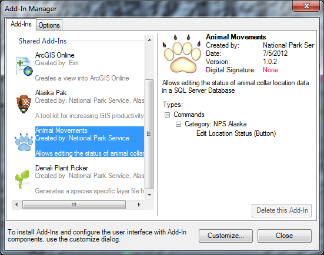

If not, make sure that you have *X:\GIS\Addins\10.1* specified as the Add-Ins folder in the Options tab.

2. Select *Customize->Customize Mode...* from the ArcMap menu.

3. Click the Commands tab

4. Scroll down to the *NPS Alaska Category*.

5. Find the *Edit Location Status* Command (paw print icon)

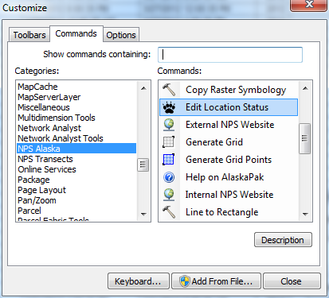

6. Click on the paw icon, and drag it over an existing toolbar (I like to use the Alaska Pak toolbar), and drop it.
   The icon should now be on the toolbar.

7. Close the Customize window.
