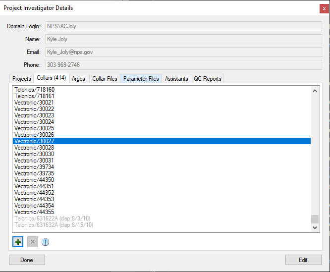
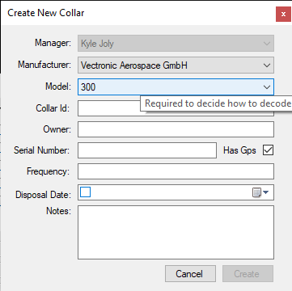
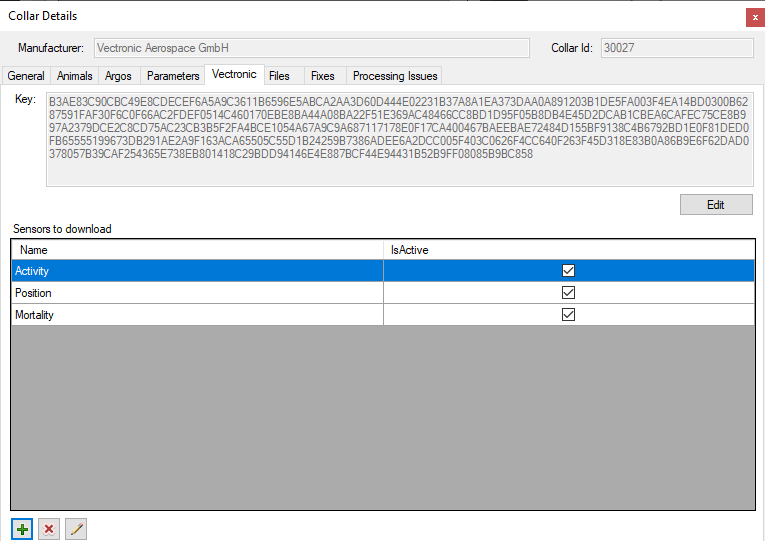
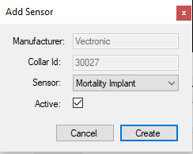

Adding a Vectronic Collar to Animal Movements
=============================================

* Open Animal Movements and open your Project Investigator Details dialog
  - You must be a Project Investigator or an assistant to a Project
     Investigator.
* Click on the Collars tab.

* Click the green add (+) button to Create a new Collar

* Select Vectronic in the Manufacturer pick list
* Enter the Collar ID (usually a 5 digit number)
  - usually in the file name of the `*registration.keyx` file, or look in the
    registration file for a line like `<collar ID="30032">`
* The remaining fields in the New Collar dialog are optional but encouraged
* Click the Create button 
* Find the new collar in the Collar list and either double click on it or
  select it and click the info (i) button.

* In the Collar Details dialog click on the Vectronic tab.
* Click on the Edit button and insert the collar key.  The key is 256
  characters long, so you will need to copy/paste it from the 
  `*registration.keyx` file.  Look for a line like `<key>7B3F83...4837F</key>`
  copy all 256 numbers/letters but not `<key>` or `</key>`
* Click the Save button
* Add Sensors that you have deployed on your collar by clicking the
  add(+) button at the bottom left of the form.

* In the Add Sensor button, select one of the sensor types in the Sensor
  pick list and make sure the Active checkbox is checked.  Click Create button.
* Position is a key sensor and is required to get location data.  Mortality and
  Activity are also supported by Animal Movements -- they are saved in a data
  table but have not elements in the UI.  The other sensors are
  not yet supported (as of December 2020) and will be ignored.
* Repeat for other sensors on the collar.  All the sensors on the collar
  will be shown in the list.  Collars in the list can be deleted or edited
  as needed.
* Repeat for additional collars.
* Kyle has several Vectronic collars that can be inspected as an example.
